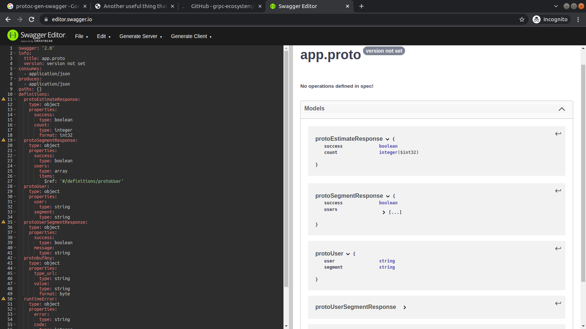

# User Estimation service

## Feature

| Title | Value |
|:-----:|:-----:|
|language| golang (v1.17) |
|architecture| full clean arch implemented |
|transport| gRPC |
|db| mongodb |
|container| docker |
|orchestrator| docker-compose |
|documentation| openAPI |

## Architecture

## Documentation

